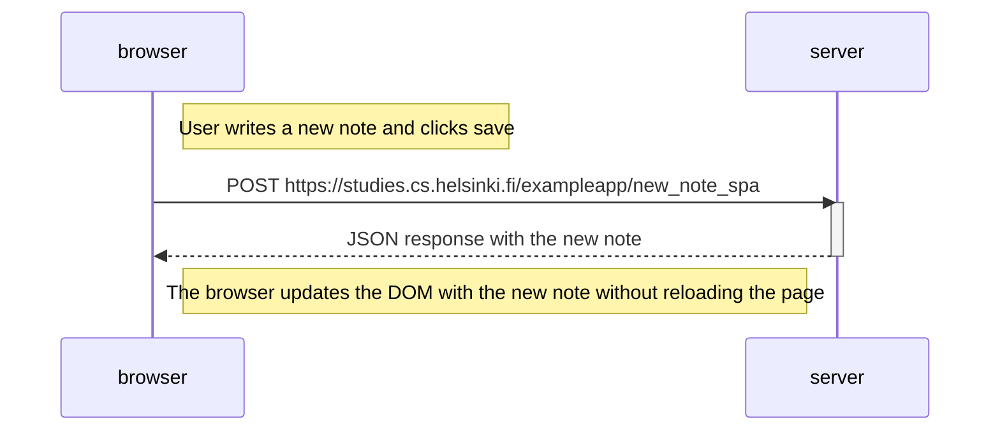

```mermaid

sequenceDiagram
    participant browser
    participant server

    Note right of browser: User writes a new note and clicks save

    browser->>server: POST https://studies.cs.helsinki.fi/exampleapp/new_note_spa
    activate server
    server-->>browser: JSON response with the new note
    deactivate server

    Note right of browser: The browser updates the DOM with the new note without reloading the page

```
